## Hey there! I'm O &nbsp;👋

Engineer by day, coding enthusiast by night. 

---

### Tech Stack

---

### Stats

<picture>
  <source media="(prefers-color-scheme: dark)" srcset="./profile/stats-dark.svg" />
  <source media="(prefers-color-scheme: light)" srcset="./profile/stats-light.svg" />
  
</picture>
&nbsp;
<picture>
  <source media="(prefers-color-scheme: dark)" srcset="./profile/top-langs-dark.svg" />
  <source media="(prefers-color-scheme: light)" srcset="./profile/top-langs-light.svg" />
  
</picture>

---

### Contributions

<picture>
  <source media="(prefers-color-scheme: dark)" srcset="./profile/github-snake-dark.svg" />
  <source media="(prefers-color-scheme: light)" srcset="./profile/github-snake.svg" />
  
</picture>
